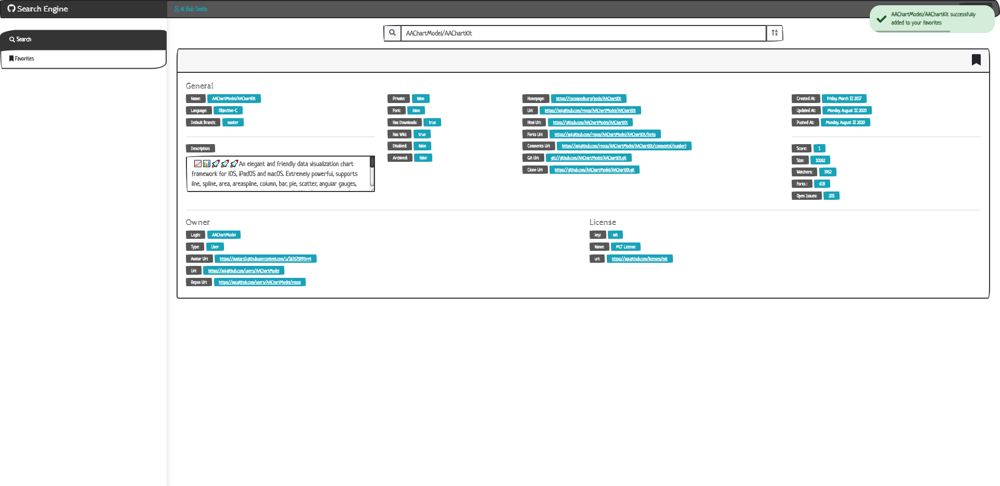
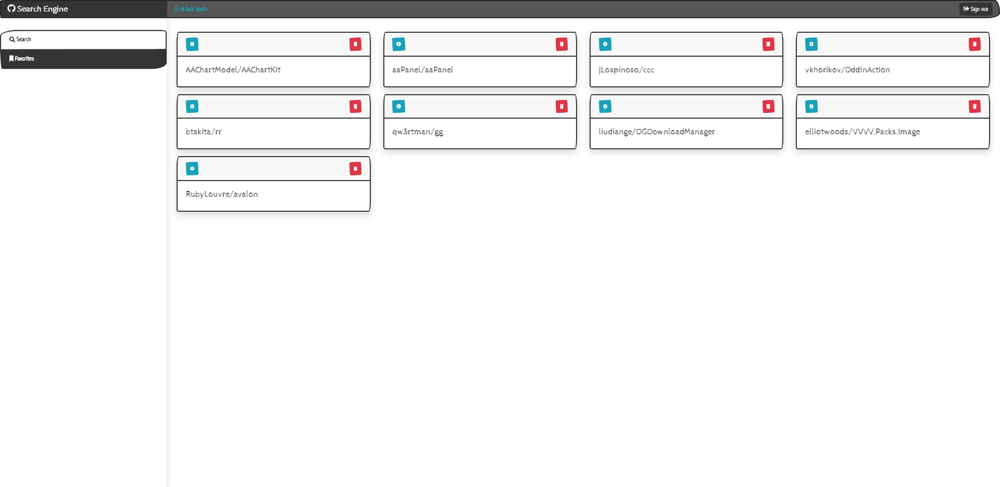

# github-search-client-app

##### [Go To Github Search Server](https://github.com/AviNessimian/GithubSearch "GithubSearch")

* You need to create a search engine in github repositories.
* the screen will display:
  - search field
  - display search results (dropdown)

* the request will be executed from the .net core server.

* upon receiving the response, the user will be granted an option to add it to his favorites.

## screens:
  - login - implemented with jwt or auth0.
  - search - only after login granted.
  - favorites - display only the favorites, will be saved in sql server.

___

**the exercise should be uploaded to github and the new repository link should be sent.** 

**(scss/sass/css - BONUS - optional) use a theme or any styles you would like to add as a new touch to your search engine.**
  
___

This project was generated with [Angular CLI](https://github.com/angular/angular-cli) version 10.0.5.
___

## Screenshot

## Development server

Run `ng serve` for a dev server. Navigate to `http://localhost:4200/`. The app will automatically reload if you change any of the source files.
